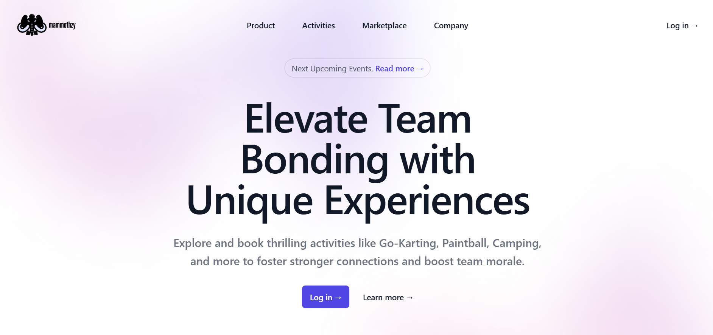
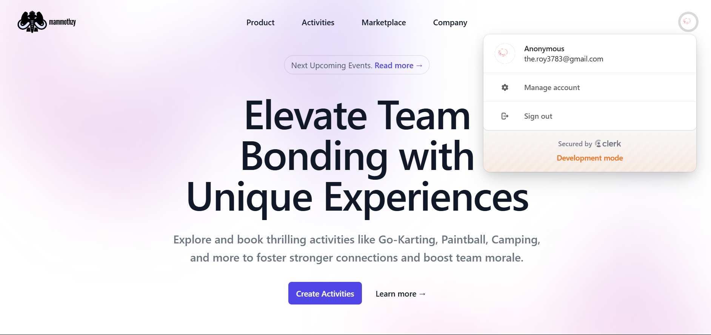
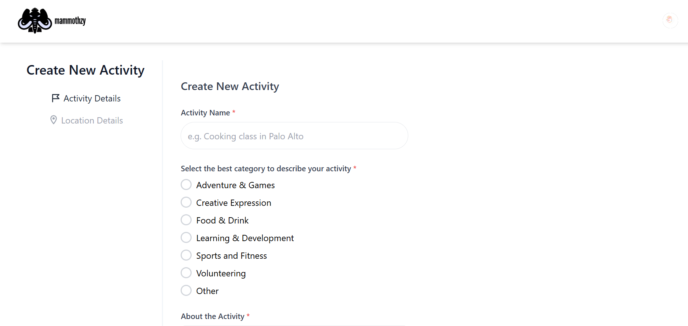
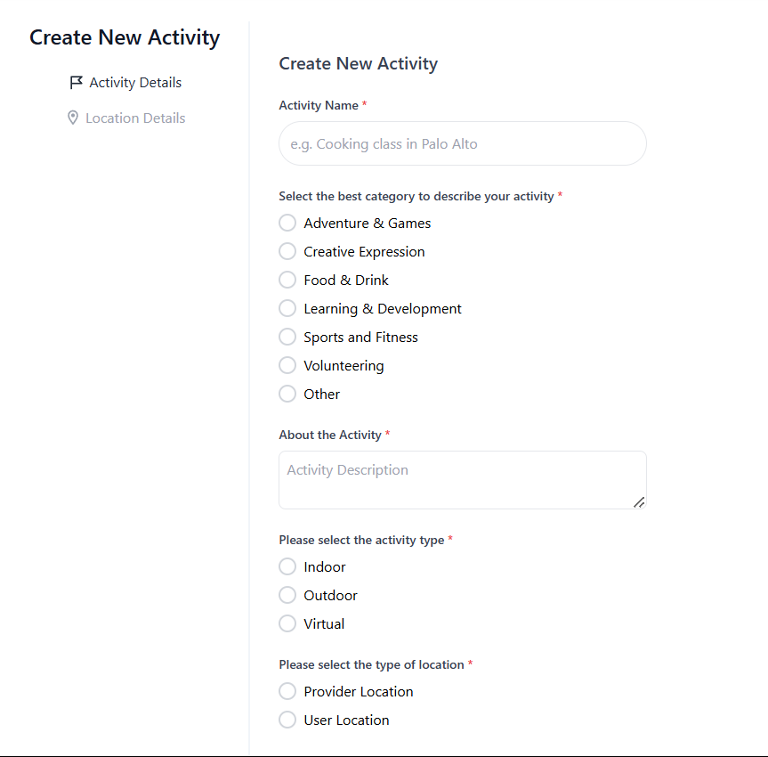
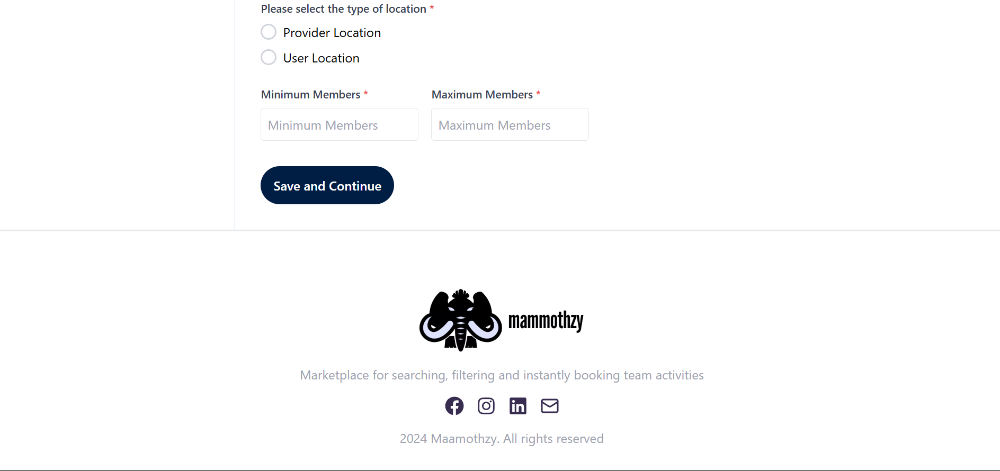
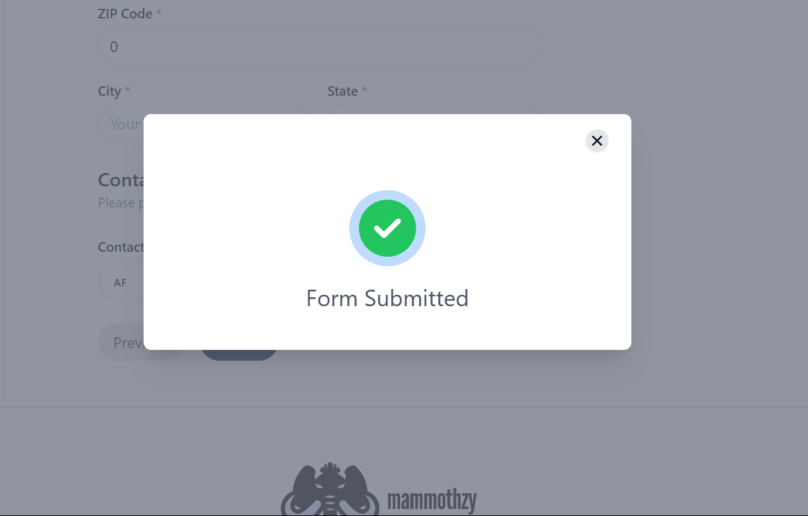
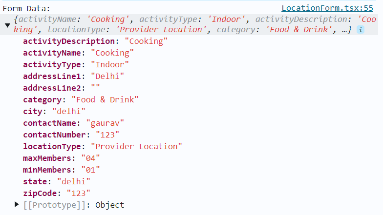

# Mammothzy - Team Bonding SaaS Platform

Mammothzy is a SaaS platform designed to facilitate team bonding activities for HR professionals or team leaders. It connects vendors (businesses that provide setups for team activities) with users (HR professionals or team leaders who are booking these activities for their teams). The platform allows HR professionals to browse, book, and manage team-building activities easily.


## Project Description

Mammothzy is built to address the need for better team engagement and bonding in corporate environments. The platform helps HR professionals or team leaders connect with various vendors that provide engaging team-building activities. It simplifies the process of discovering, booking, and managing activities to strengthen team cohesion.

---
## Live demo

[](https://app.netlify.com/sites/mammothzy/deploys)

Deployed Link : https://mammothzy.netlify.app/
Github Repo : https://github.com/gauravxroy/mammothzy


## Tech Stack

The following technologies are used to build **Mammothzy**:

- **Frontend**: 
  - React.js
  - Next.js
  - Zustand
  - TailwindCSS / CSS Modules
  - Tailwind UI
  
- **Package Manager**:
  - Npm
  

- **Authentication**:
  - Clerk Auth

- **Other**:
  - Git / GitHub for version control
  - Netlify
  - React Icons
  - Eraser.Io
  - Vs Code


## Folder Structure


## Flow Of App


## Example Images

Here are some example images app’s user interface and key features:

### 1. **User Dashboard**



### 2. **Loged In Page**


### 3. **Activity Booking Form**





### 4. **Footer**





---

### 5. **Walkthrough Video**

[Watch the full walkthrough](MammothzyDemonstration1.mp4)

**Video Link**: https://drive.google.com/drive/folders/1GNAPIyEzIoLU6ZOJXxpgl5jMB1JtPoBg?usp=sharing

### 7. **Form Submitted**



### 7. **Form Data**



## Forking the Repository

To fork this repository, follow these steps:

1. Go to the [Mammothzy repository](https://github.com/gauravxroy/mammothzy) on GitHub.
2. Click the **Fork** button at the top-right of the page.
3. Select your GitHub account where you want to fork the repository.
4. The repository will be copied to your account and you can start working on it.

---

## Cloning to Local Machine

Once the repository is forked, follow these steps to clone it to your local machine:

1. Open your terminal or Git Bash.
2. Clone the repository using the following command:

```bash
git clone https://github.com/gauravxroy/mammothzy
```

3. Navigate to the project directory:

```bash
cd mammothzy
```

---

## Installation Guide

### Prerequisites

Make sure you have the following software installed:
- **Node.js** (version 20 or higher)
- **npm** or **yarn**


### Steps

1. After cloning the project, navigate to the project directory if you haven't already:

```bash
cd mammothzy
```

2. Install dependencies:

```bash
npm install


3. Create a `.env` file in the root directory for environment variables (e.g., database connection, JWT keys, etc.):

```bash
cp .env.example .env
```

4. Set up your environment variables in the `.env` file.

5. Run the development server:

```bash
npm run dev
# or if you're using yarn:
# yarn dev
```

Your local server should now be running at `http://localhost:3000`.

---

## Usage

Once the project is up and running, you can use it by visiting `http://localhost:3000` in your web browser. The web app will allow you to:

- Browse team-building activities.
- Book activities for your team.
- Manage bookings and activities.

For mobile applications, follow the instructions in the **Mobile App** section to run it on your local device/emulator.

---

## Contributing

We welcome contributions to **Mammothzy**! To contribute, follow these steps:

1. Fork the repository.
2. Clone your forked repository to your local machine.
3. Create a new branch:

```bash
git checkout -b your-feature-branch
```

4. Make changes and commit them:

```bash
git add .
git commit -m "Description of changes"
```

5. Push to your forked repository:

```bash
git push origin your-feature-branch
```

6. Open a Pull Request to the main repository with a description of your changes.

---


## Contact

For any inquiries or issues, please reach out to:
- **Developed And Created By**
- **Name**: Gaurav
- **GitHub**: [(https://github.com/gauravxroy)]


Documentations: 

Check out our [Next.js deployment documentation](https://nextjs.org/docs/app/building-your-application/deploying) for more details.

Next.js: https://nextjs.org/docs/app/getting-started/installation

TypeScript: https://www.typescriptlang.org/

Clerk: https://clerk.com/docs/quickstarts/nextjs


tailwind: https://tailwindcss.com/docs/installation


zustand: https://zustand.docs.pmnd.rs/getting-started/introduction